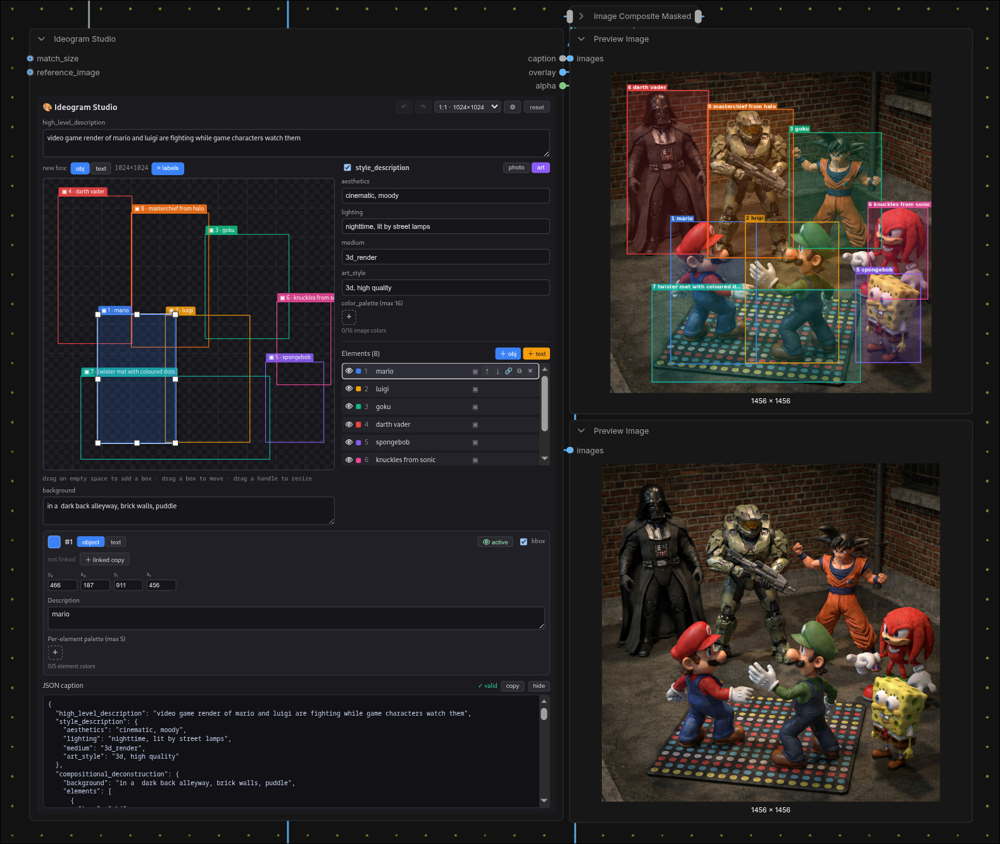

# ComfyUI-IdeogramHelper

A visual **studio** for composing [Ideogram 4](https://ideogram.ai/models/4.0/)
structured-JSON box prompts inside ComfyUI — drag boxes on a canvas, write into
them, and get the exact wire-format caption plus an overlay you can composite
over your result.



Ideogram 4 is trained on structured JSON captions: a `high_level_description`, a
`style_description`, and a `compositional_deconstruction` of bounding-boxed
`elements`. Writing that by hand is tedious — this studio makes it visual.

## Install

```bash
cd ComfyUI/custom_nodes
git clone https://github.com/nynxz/ComfyUI-IdeogramHelper
```

The frontend ships pre-built in `js/`. Restart ComfyUI, then add
**Ideogram → Ideogram Studio**.

## Quick start

1. Drop an **Ideogram Studio** node.
2. Set the **resolution** (the chip in the bottom bar — aspect ratio ×
   megapixels, or type an exact W×H); the canvas and overlay use it.
3. **Drag on empty canvas** to add a box; drag a box to move it, drag a handle to
   resize. Toggle each box between **object** and **text**. Ctrl/Shift-click to
   multi-select and move several boxes together.
4. Fill in the **summary** (high-level description), **background**, per-box
   **descriptions** (and literal **text** for text boxes), and the **style panel**.
5. Wire **`caption`** into your Ideogram sampler's prompt.
6. (Optional) Add an **Ideogram Studio Extras** node off the **`extras`** output
   to get `overlay` / `alpha` / `width` / `height`, then **ImageCompositeMasked**
   the overlay over your generation (using `alpha` as the mask) to check whether
   the model placed things where your boxes were — the right-hand side of the
   screenshot above.

> 💡 **App Mode:** the studio also works as a standalone panel in ComfyUI's App
> Mode — a focused, full-screen prompt builder with the graph out of the way.
>
> 

## Example workflow

Want a ready-made graph? **Drag
[`workflow_example.png`](.github/assets/workflow_example.png) onto the ComfyUI
canvas** — the full example (studio → sampler → overlay compare) is embedded in
the image and loads instantly. Prefer the raw file? Grab
[`id4studio_workflow.json`](.github/assets/id4studio_workflow.json) and load it
via **Workflow → Open**.

## Nodes

Four nodes, all under the **Ideogram** category. Only **Ideogram Studio** is
required — the other three are optional helpers that snap onto its ports. In
short: an optional **Override** feeds the **Studio**; the Studio's `caption` goes
to your sampler and `extras` to an **Extras** node for the overlay; and a **Ref
Sync** node placed after a generation pushes it back as a trace backdrop.

### Ideogram Studio — the editor *(required)*

The whole UI — resolution, overlay style, boxes, palettes — lives in the node
widget, so nothing is configured in two places. Outputs the finished caption and
a bundle of render extras.

| Port | Dir | Type | Notes |
| :--- | :-- | :--- | :--- |
| `overrides` | in *(optional)* | `IDEOGRAM_OVERRIDE` | Patches from an Override node. |
| `caption` | out | `STRING` | Minified canonical JSON — wire into any Ideogram sampler. |
| `extras` | out | `IDEOGRAM_EXTRAS` | Overlay/alpha/width/height bundle — unpack with **Extras**. |

### Ideogram Studio Extras — unpack the overlay *(optional)*

Splits the studio's `extras` bundle into usable ports. Kept off the main node so
the studio stays compact; only add it when you want the overlay.

| Port | Dir | Type | Notes |
| :--- | :-- | :--- | :--- |
| `extras` | in | `IDEOGRAM_EXTRAS` | From the studio's `extras` output. |
| `overlay` | out | `IMAGE` | Boxes + labels + text + palette swatches, at the chosen resolution. |
| `alpha` | out | `MASK` | Overlay alpha — use as the mask in **ImageCompositeMasked**. |
| `width` / `height` | out | `INT` | The studio's resolution, e.g. to feed an Empty Latent. |

### Ideogram Studio Override — drive fields from the graph *(optional)*

An **input** breakout: set any of these from the graph and they override the
studio's own values (handy for sweeps/automation). Blank fields — and `medium`
left at **`(keep)`** — are ignored. Filling `photo` forces photo-mode, `art_style`
forces art-mode.

| Port | Dir | Type | Notes |
| :--- | :-- | :--- | :--- |
| `high_level_description`, `background`, `aesthetics`, `lighting` | in *(optional)* | `STRING` | Override the matching field. |
| `medium` | in *(optional)* | combo | Photograph / illustration / … or `(keep)`. |
| `photo`, `art_style` | in *(optional)* | `STRING` | Sets photo- / art-mode style text. |
| `colors` | in *(optional)* | `STRING` | Image palette — comma-separated hex (raw, or from a **Palette** node), max 16. |
| `overrides` | out | `IDEOGRAM_OVERRIDE` | Wire into the studio's `overrides` input. |

### Ideogram Studio Palette — pick colours visually *(optional)*

A small node with the same swatch editor as the studio (＋ to add, ✕ to remove,
click to recolour). It outputs the palette as comma-separated hex — wire it into
an Override's `colors` input so you can **pick colours instead of typing raw hex**.

| Port | Dir | Type | Notes |
| :--- | :-- | :--- | :--- |
| `palette` (widget) | — | — | The visual swatch editor. |
| `colors` | out | `STRING` | Comma-separated `#RRGGBB` → an Override's `colors`. |

### Ideogram Studio Element Override — overwrite one element by index *(optional)*

Programmatically replace a single element's description / text / colours by its
number — e.g. if **element 1** is your character, drive its `desc` from the graph.
`id` is the element number shown in the studio (starts at 1); blank fields are
ignored and `text` only applies to text elements. To patch several at once, feed
multiple of these into an **Override List** (below).

| Port | Dir | Type | Notes |
| :--- | :-- | :--- | :--- |
| `id` | in | `INT` | Which element to overwrite (the number shown in the list, from 1). |
| `desc` | in *(optional)* | `STRING` | New description for that element. |
| `text` | in *(optional)* | `STRING` | New literal text (text elements only). |
| `colors` | in *(optional)* | `STRING` | Comma-separated hex (e.g. `#FF0000, #0a0, FFAA00`), max 5. |
| `overrides` | out | `IDEOGRAM_OVERRIDE` | Wire to an Override List or the studio. |

### Ideogram Studio Override List — combine many overrides *(optional)*

Merges several override bundles into one, with **autogrowing inputs** — plug an
Override / Element Override into a slot and a fresh empty slot appears, so you can
build a list of per-element overrides without chaining. Wire the single output
into the studio's `overrides` input. (Scalar fields take the last value; `style`
and per-index element patches are merged.)

| Port | Dir | Type | Notes |
| :--- | :-- | :--- | :--- |
| `overrides_1`, `overrides_2`, … | in *(optional)* | `IDEOGRAM_OVERRIDE` | Grow automatically as you connect. |
| `overrides` | out | `IDEOGRAM_OVERRIDE` | The merged bundle → studio. |

### Ideogram Studio Ref Sync — trace over a generation *(optional)*

An **output** node for the iterate loop: route a generation into it and, with a
studio's **sync** toggle on, that image appears under your boxes as a trace
backdrop. So: generate → see it under the boxes → tweak → regenerate. It
re-broadcasts every run (so a page refresh re-syncs on the next queue) and reaches
**every** studio that has sync on.

| Port | Dir | Type | Notes |
| :--- | :-- | :--- | :--- |
| `image` | in | `IMAGE` | The generation (or any image) to trace. |
| `enable` | in | `BOOLEAN` | Off = pass through without syncing. |
| `image` | out | `IMAGE` | Passthrough, so the node sits inline. |

### Ideogram Studio JSON Sync — push a caption into the studio *(optional)*

The text-side counterpart to Ref Sync: feed it a JSON caption and any studio with
**json sync** on (the ⟳ toggle in the JSON bar) imports it live into the editor —
handy for loading captions from another node, an LLM, or a saved file.

| Port | Dir | Type | Notes |
| :--- | :-- | :--- | :--- |
| `json` | in | `STRING` | An Ideogram JSON caption (paste, or wire one in). Invalid JSON errors the node. |
| `enable` | in | `BOOLEAN` | Off = pass through without syncing. |
| `json` | out | `STRING` | Passthrough, so the node sits inline. |

## Features

- **Drag-and-drop boxes** — drag empty canvas to add a box, drag it to move, grab
  a handle to resize.
- **Multi-select & group move** — Ctrl/Shift-click boxes (on the canvas or in the
  list) to move several at once.
- **Object & text boxes** — text boxes carry the exact words to render, plus a
  description of how they should look.
- **Per-box colours** keep overlapping boxes readable, and the overlay keeps every
  box visible even when they overlap.
- **Mute** a box to keep it in the editor but leave it out of the prompt — no need
  to delete it.
- **Linked boxes** — reuse one prompt across several positions; edit one and the
  rest follow.
- **Style panel** — photo or art direction, with image-wide and per-box colour
  palettes.
- **Reference backdrop** — drop in an image (or live-sync a generation) to trace
  over; it's never sent to the model.
- **Overlay output** — composite the boxes over your result to check whether the
  model placed things where you asked.
- **Smart resolution** — pick an aspect ratio + megapixels, or an exact size; it
  matches what the model actually outputs so the overlay lines up.
- **Live JSON** with friendly warnings, undo/redo, and paste-to-import an existing
  caption.
- **Light & dark** — follows your ComfyUI theme.

> Under the hood it writes Ideogram's exact JSON format for you, and editor-only
> bits like box colours and links never end up in the prompt.

## Development (frontend)

```bash
npm install        # or reuse a sibling node's node_modules
npm run build      # -> js/main.js   (vite lib build)
npm run dev        # watch mode
```

`js/main.js` is committed on purpose — ComfyUI serves it directly and users never
run a build. Commit source and the rebuilt bundle separately. Hard-refresh the
browser after a frontend build; restart ComfyUI after Python changes (node
definitions load at startup).
